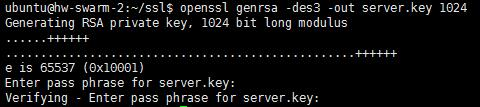
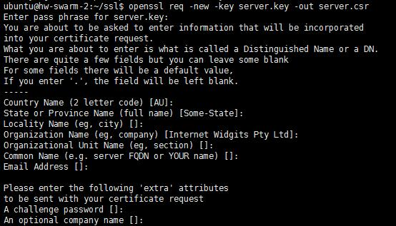
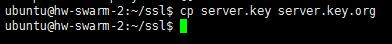
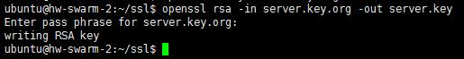

## Https证书生成：
  * 创建服务器私钥，命令会让你输入一个口令：
    ```
    openssl genrsa -des3 -out server.key 1024
    ```
    
  * 创建签名请求的证书（CSR）：<br/>
    ```
    openssl req -new -key server.key -out server.csr
    ```
    
  * 在加载SSL支持的Nginx并使用上述私钥时除去必须的口令：
    ```
    cp server.key server.key.org
    
    openssl rsa -in server.key.org -out server.key
    ```
    
    
    
  * 最后标记证书使用上述私钥和CSR：
    ```
    openssl x509 -req -days 365 -in server.csr -signkey server.key -out server.crt
    ```
    
  * Copy the files server.crt, server.key into your nginx config folder